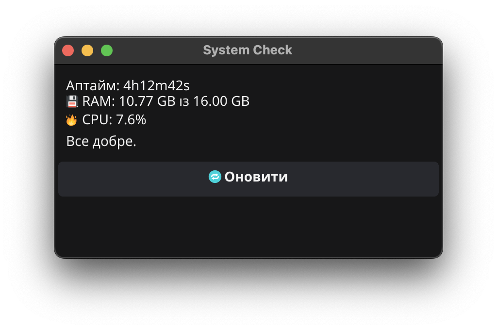

# 🖥️ System Check GUI

**System Check GUI** — це легка, швидка та зручна програма для macOS, написана мовою **Go**, що дозволяє моніторити:

- 🧠 Оперативну памʼять (RAM)
- 🔥 Завантаження процесора (CPU)
- 🕒 Аптайм системи
- 📋 Автоматичні поради при перевантаженні

Програма має графічний інтерфейс (GUI) на базі бібліотеки [fyne](https://fyne.io/) і може запускатися як звичайний `.app` із робочого столу.

---

## 🚀 Можливості

- Відображення RAM, CPU та аптайму
- Поради при нестачі ресурсів
- Кнопка «Оновити» для ручного оновлення
- Збірка у вигляді `.app` з іконкою
- Працює швидко, без зайвих процесів

---

## 📦 Встановлення та запуск

### Тобі потрібно:

### 🔧 1. Клонувати репозиторій

```bash
git clone https://github.com/hesher116/system_check_gui.git
cd system_check_gui
```

### 📦 2. Встановити залежності

```bash
go mod tidy
```

### ▶️ 3. Запуск

```bash
go run main.go
```

### 🛠 4. Збірка `.app` для macOS

```bash
fyne package -os darwin -icon icon.png
```

> Після цього зʼявиться файл `system_check_gui.app`.  
> Його можна запустити подвійним кліком або створити ярлик на Робочий стіл.

---

## 📁 Структура проєкту

```
system_check_gui/
├── main.go          # Основний код GUI
├── go.mod           # Модуль Go
├── icon.png         # Іконка для .app
└── README.md        # Інструкція
```

---

## 🖼️ Скриншот



---

## 🧠 Для кого

- Початківцям у Go та GUI
- Користувачам macOS, які хочуть бачити RAM/CPU
- Для портфоліо або як навчальний pet-проєкт

---

## ⚖️ Ліцензія

MIT — безкоштовне використання, редагування, розповсюдження.

---

## 🙌 Автор

**@hesher116**  
Навчальний проєкт у процесі вивчення Go, GUI та системної оптимізації.
